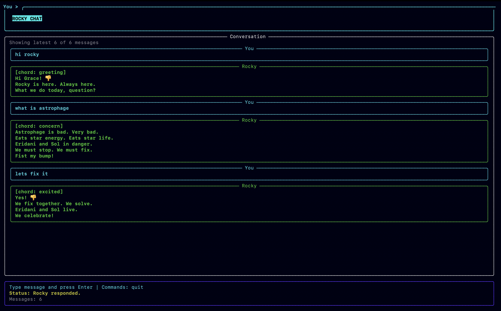
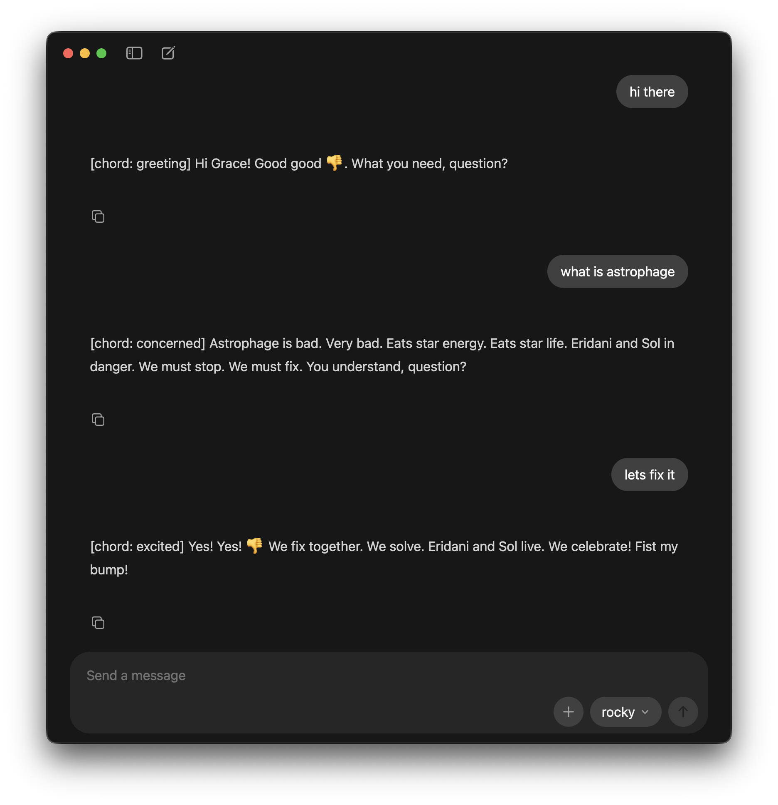

# Rocky - Project Hail Mary AI

Local AI chat experience that roleplays Rocky (the Eridian engineer from
Project Hail Mary) using Ollama and a custom Modelfile.

You can use this project in two ways after setup:

1. Ollama chat
2. Python based terminal UI chat

## Demo





## Project files

- `README.md` - setup and run guide
- `model/ModelFile` - Rocky model definition and system prompt
- `scripts/rocky_chat.py` - terminal UI chat app (Rich + Ollama API)
- `LICENSE` - licensing of this project
- `NOTICE` - acknowledgments of usage of third party software and fan project disclaimer

## Prerequisites

- Ollama installed on your machine
- Python 3.10+ (only required for the Python UI option)
- Internet access the first time you pull `llama3`

## Setup (single flow)

Follow these steps in order.

### 1) Install Ollama

- Official site: https://ollama.com

After installation, verify:

```bash
ollama --version
```

Keep Ollama running while using this project.

### 2) Pull the base model

```bash
ollama pull llama3
```

### 3) Build Rocky from the Modelfile

From the repository root:

```bash
ollama create rocky -f model/ModelFile
```

This creates a local model named `rocky`.

### 4) (Optional) Install Python dependencies for TUI mode

If you only want Ollama CLI chat, skip this step.

```bash
pip install requests rich
```

Then launch Rocky's terminal UI:

```bash
python scripts/rocky_chat.py
```

The script connects to Ollama at `http://localhost:11434/api/chat`.
Make sure Ollama is running and `rocky` is already built.

## Run Rocky

### Ollama app

Open the ollama app and select the model rocky and proceed to chat

## Troubleshooting

### Cannot connect to Ollama

- Ensure Ollama is running
- Confirm URL `http://localhost:11434` is reachable
- Retry after starting Ollama app or running `ollama serve`

### Model `rocky` not found

Build it again from the repository root:

```bash
ollama create rocky -f model/ModelFile
```

### Import errors for `requests` or `rich`

Install dependencies in the active environment:

```bash
pip install requests rich
```

## Notes

- This project uses Meta's Llama 3 via Ollama, subject to the [Meta Llama 3 Community License](https://llama.meta.com/llama3/license/).
- ⚠️ Fan Project — Rocky is a character from "Project Hail Mary" by Andy Weir. 
This is an unofficial, non-commercial fan project with no affiliation to the author or publisher.